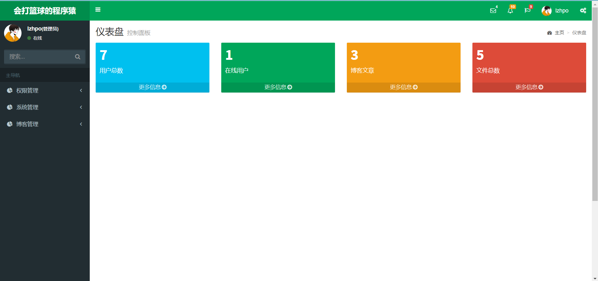
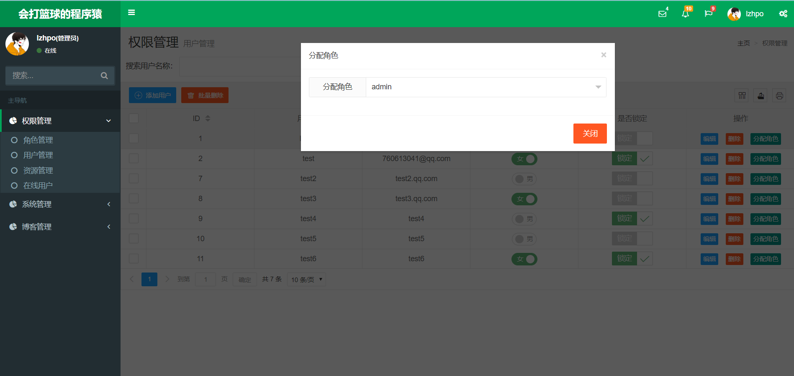
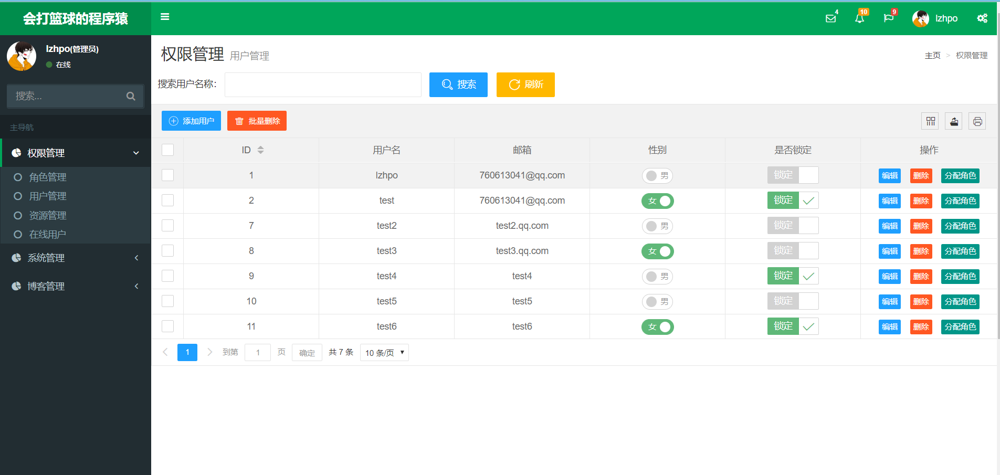
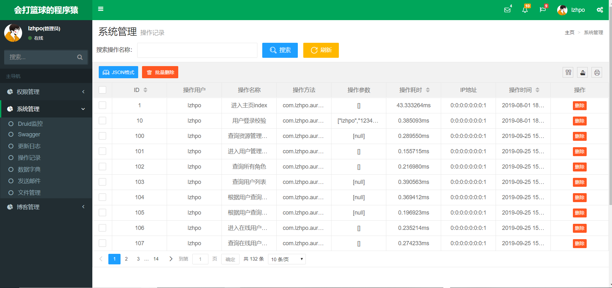
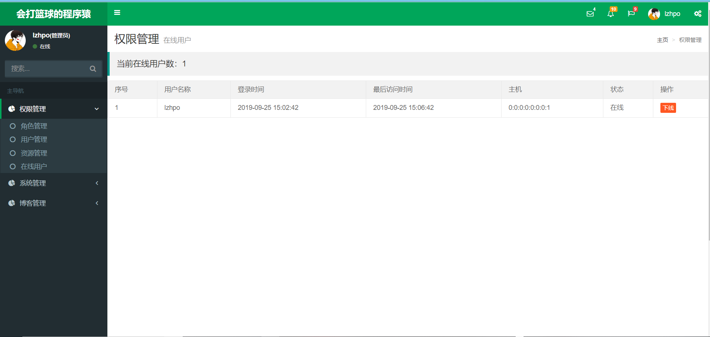
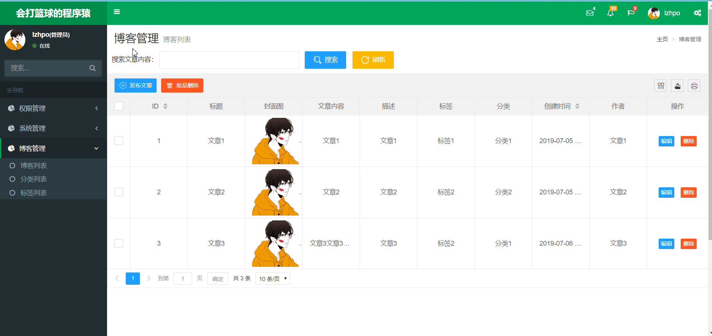
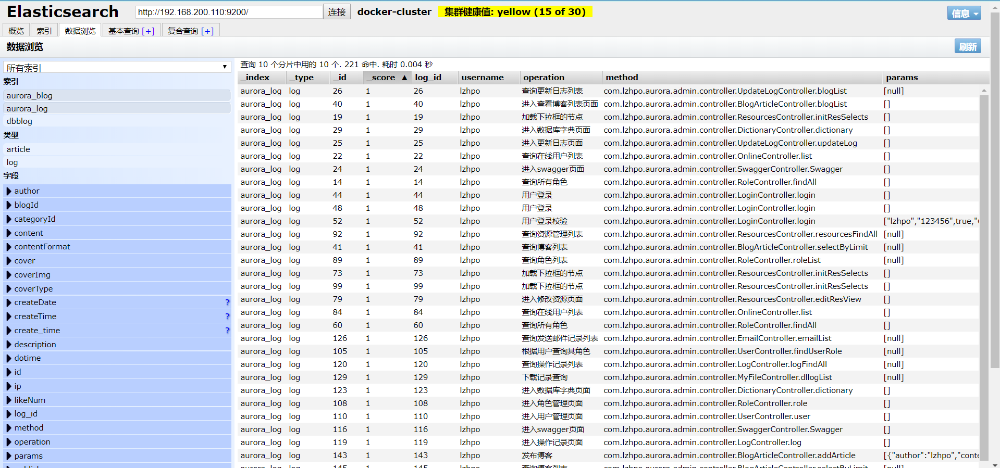
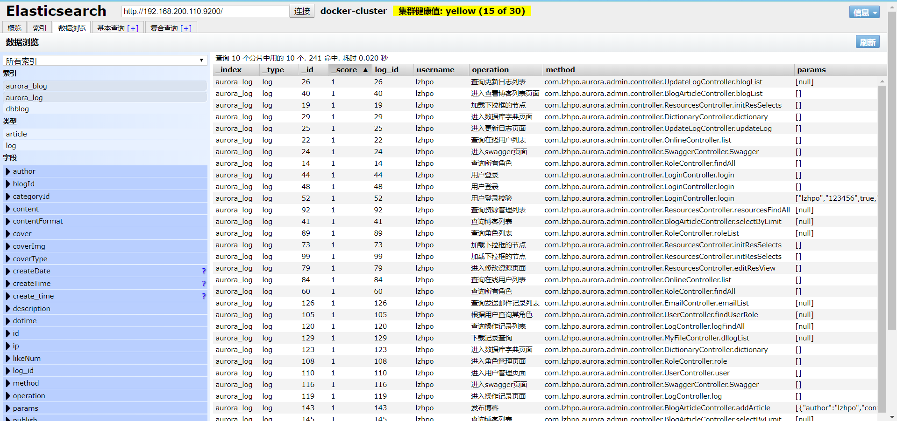
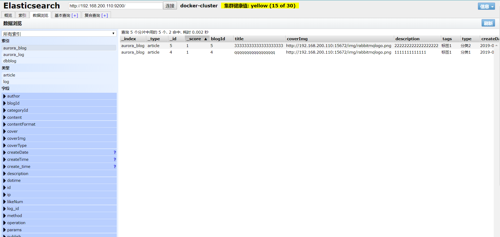
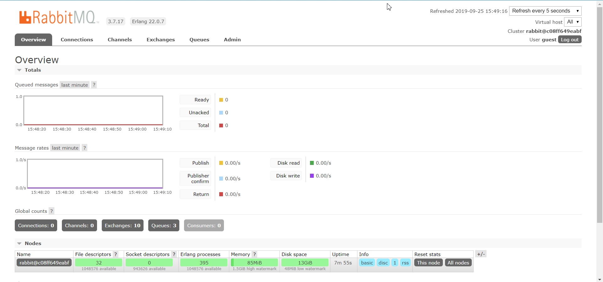

## 页面截图

## 技术栈
1. Thymeleaf
2. SpringBoot
3. Mybatis
4. Lombok
5. MySQL
6. Druid
7. fastjson
8. shiro
9. Redis
10. jsoup
11. kaptcha
12. swagger2
13. ELK（ElasticSearch、Logstash、Kibana）
14. RabbitMQ

## 启动项目
1. 安装MySQL，导入docs下的sql文件。
2. 安装Redis，并且在`application.yml`文件下配置Redis的连接信息。
3. 安装ElasticSearch，并且在`application.yml`文件下配置ElasticSearch的连接信息。（不使用ElasticSearch，设置`ES.Enable`为false即可，默认flase）
4. 【此步非必须，用于学习的，可以不配置】安装RabbitMQ、Logstash、Kibana/ElasticSearch Head，在`logback-spring.xml`文件下配置RabbitMQ的连接信息，Logstash的配置信息在`ELK+MQ收集日志.md`。（Spring集成Rabbitmq收集Logback日志，利用进行Logstash数据整理存储到Elasticsearch中）
5. 启动`com.lzhpo.aurora.AuroraApplication`。

访问：[localhost:8080/admin](localhost:8080/admin)
账号：lzhpo
密码：123456

## 项目说明
### 日志收集（仅仅是学习一下）
内置了日志可以存储在MySQL或ElasticSearch中。
额外：使用Spring继承RabbitMQ，将SpringBoot的Logback的日志发送到RabbitMQ，再使用Logstash将日志存储到Elasticsearch中。

## 碎碎念
本项目是本人在大二写了二十多天写的，几乎天天熬夜，其中通宵了很多次，其中的心酸只有自己知道，如有写的不好的地方还望各位指正，谢谢各位！
由于要准备工作了，此项目先放置了。

如果有什么问题，请发送邮件lzhpo@qq.com联系我！或者提Issue！

## 请本人喝杯咖啡
### 支付宝

### 微信
